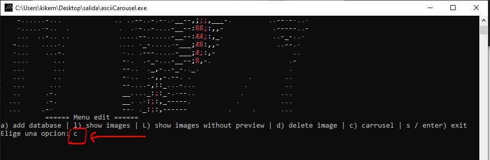
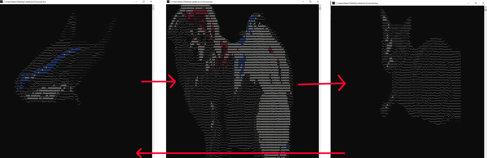
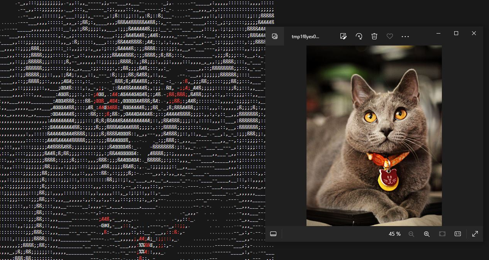
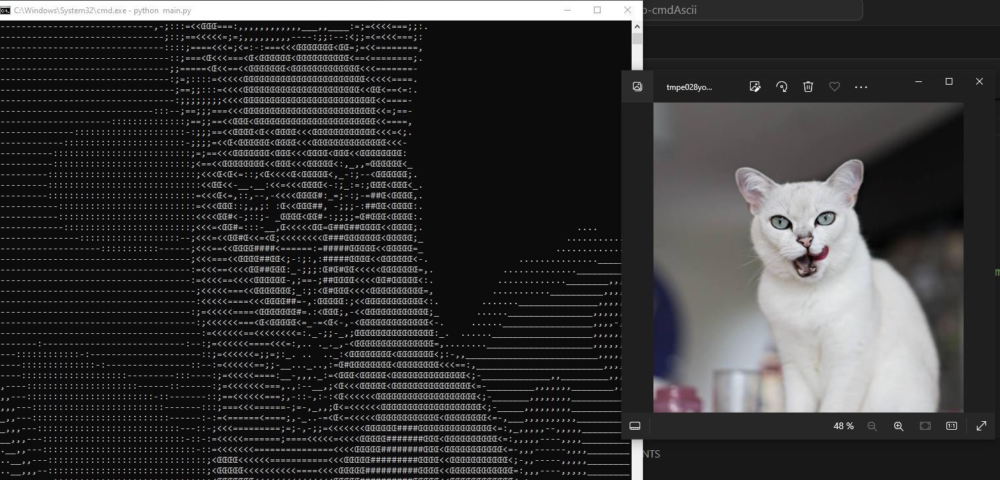
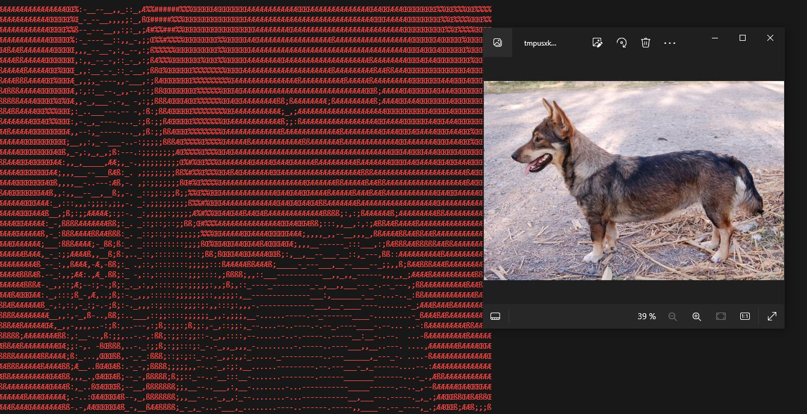
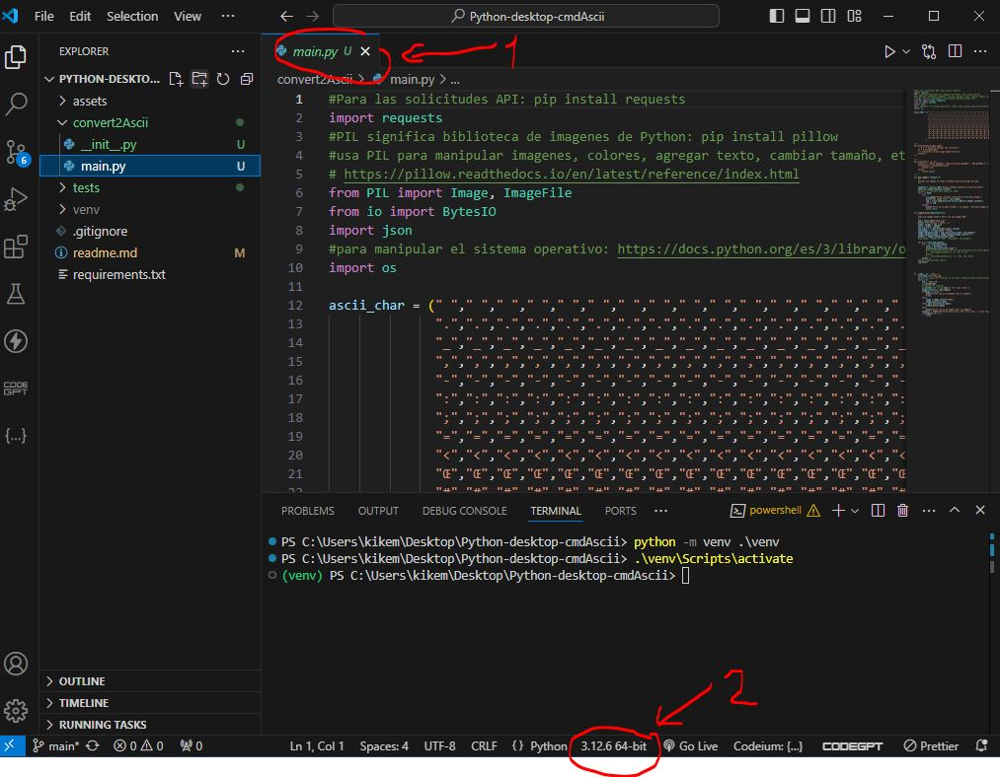
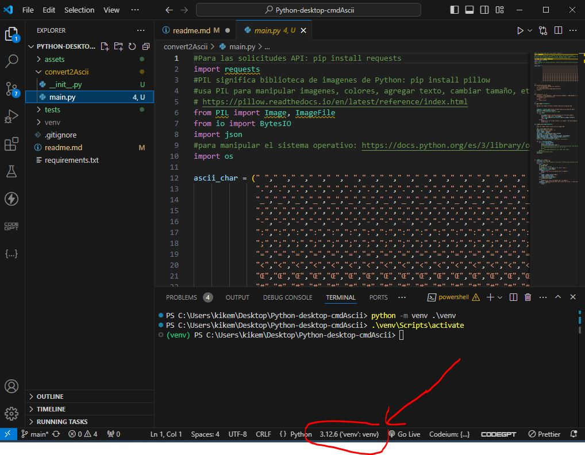

# Que es asciiCarousel

Es un programa cmd que te muestra imágenes de animales descargadas de internet en ascii,
y que puedes agregar a tu lista para después comenzar el carrusel de imágenes pulsando la tela c.

También puedes usarlo dede el terminal.
Escribe en la terminal para desplazarte al lugar de instalación:
cd C:\Program Files\asciiCarousel

Ahora puedes usar estos comandos:
 Usage: asciiCarousel [OPTIONS]

Options:                                                                                                            
│ --mode    INTEGER [default: 1] Selecciona 0 para blanco y negro, 1 para colores

│ --color   TEXT [default: white] El color del texto, solo en modo 0

│ --notshow Para no mostrar la previsualización   

│ --rembg   Para usar remove background      

│ --help    Show this message and exit.   

Examples:

   asciiCarousel --notshow

   asciiCarousel --mode 0 

 asciiCarousel --mode 0 --color red

## Download

https://github.com/kikemadrigal/Python-desktop-asciiCarousel/releases/download/v0.1.0/asciiCarousel.zip

# Development

1. Crea un entorno virtual con python -m venv .\venv
2. Métete en el entorno virtual con .\venv\Scripts\activate, recuerda que para salir tienes que escribir dentro del entorno virtual "deactivate".
3. Para que VSCode trabaje dentro del entorno virtual, dentro de VSCode  y con un archivo.py abierto pulsa Ctrl+Shift+p y escribe en la paleta de  comandos >Python select interpreter, luego selecciona el Python X.XX.X ("env":env), asegurate de que vas a interpretar con él mirando aquí:   
   
   debe quedar así:
   
4. Escibe en el terminal o cmd: pip install -r requirements.txt
5. Para poder utilizar las funciones de borrado del fondo, escrie en el terminal o cmd  pip install rembg
6. Situate dentro del directorio de asciiCarousel y dentro escribe: python -m PyInstaller --onefile --console --icon=..\assets\icon.ico --clean -y -n "asciiCarousel" main.py
7. Para crear el instalador utiliza el programa innosetup: https://jrsoftware.org/isdl.php